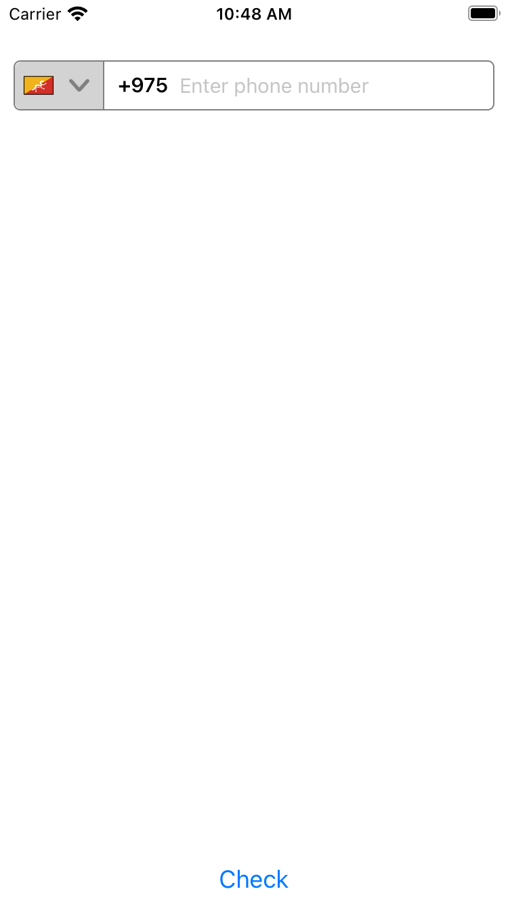
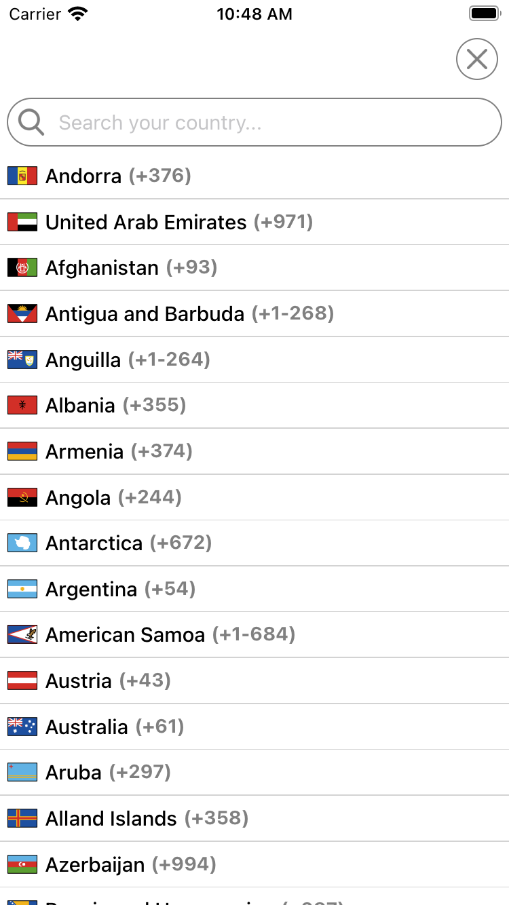

# react-native-phone-validation

This package will provide a PhoneValidation component which validate different countries phone number as per maximum digits

## Installation

```sh
npm install react-native-phone-validation
```

## Usage

```js
import React, { useState } from 'react';
import { Button, SafeAreaView } from 'react-native';
import PhoneValidation, {
  checkPhoneValidation,
} from 'react-native-phone-validation';

const App = () => {
  const [country, setCountry] = useState();
  const [value, setValue] = useState();

  return (
    <SafeAreaView style={{ flex: 1 }}>
      <PhoneValidation setCountry={setCountry} setValue={setValue} />
      <Button
        title="Check"
        onPress={() => {
          const result = checkPhoneValidation(country, value);
          console.log(result);
        }}
      />
    </SafeAreaView>
  );
};

export default App;
```

<!-- 

 -->

          

## Contributing

See the [contributing guide](CONTRIBUTING.md) to learn how to contribute to the repository and the development workflow.

## License

MIT

---

Made with [create-react-native-library](https://github.com/callstack/react-native-builder-bob)
